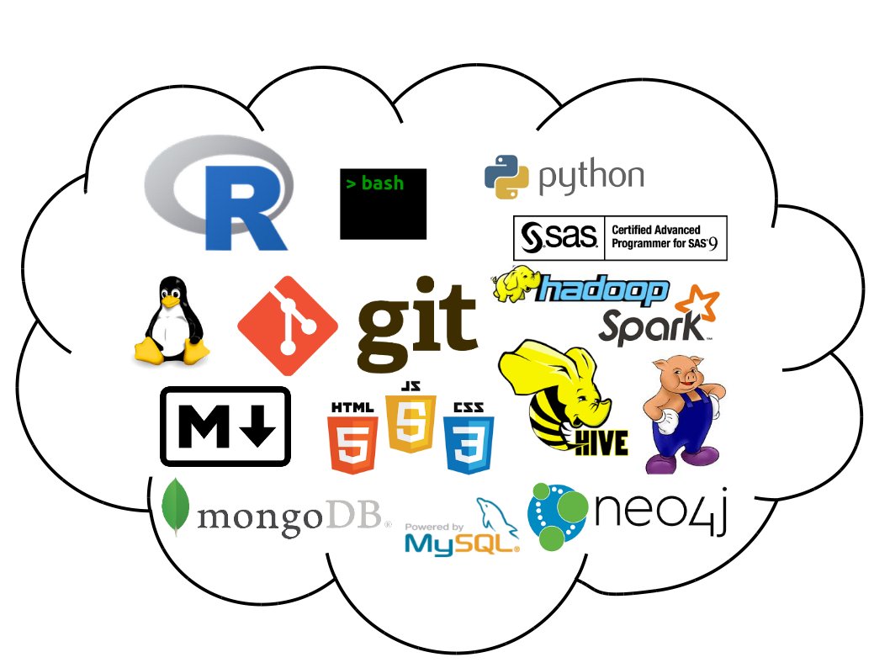

# Hello, world!

My name is Dan Negrey, and I am a **[Data Scientist](https://en.wikipedia.org/wiki/Data_science)** based in Cleveland, OH. I am passionate about ***statistical computing***, ***data visualization***, ***machine learning*** and ***reproducible research***. I strive to utilize best practices throughout my work which includes promoting and teaching these techniques to others.

### Latest news

* *March 4, 2017*: new project - [Data Days CLE 2017: Introducing R](/projects/dataDaysCLE.html)
* *October 25, 2016*: new project - [MLB Dashboard](https://dnegrey.shinyapps.io/mlbDashboard/)
* *May 15, 2016*: blog post - [Leaflet by Example: Election 2000
](/blog/posts/2016-05-15-election)
* *April 4, 2016*: new site launched, built using [R Markdown](http://rmarkdown.rstudio.com/)!

### A little bit about the site...

This is the central hub for my professional portfolio. My goal is that visitors gain an understanding about data science through a variety of [resources](/resources), learn about the [projects](/projects) on which I am working, enjoy some interesting [blog](/blog) posts and get to know a little more [about](/about) me.

### Technology approach

I consider myself "technology agnostic". Fortunately, the nature of my work lends itself to using a variety of tools. I generally prefer open-source technologies and as my work greatly emphasizes analytics and visualization, I am a very enthusiastic **[R](https://www.r-project.org/)** user! I use **[git](https://git-scm.com/)** for version control and honestly don't know how I ever lived without it (I refer to this earlier period in my life as "b.g." - before git). Below is a snapshot of some of the tools and technologies that I commonly use:

\  

\  

\  
